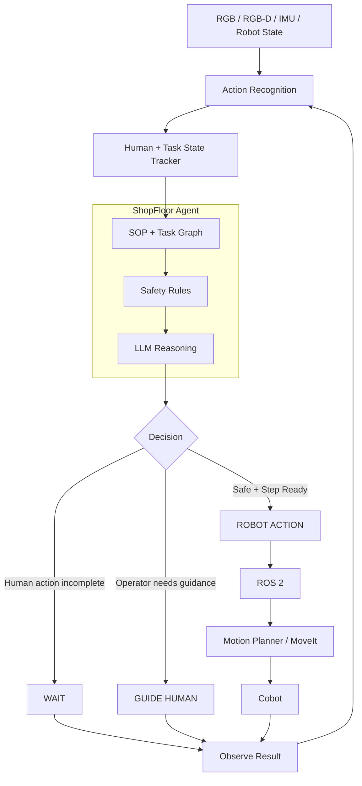

# ShopFloor Agent

Procedure-compliant assembly assistant for MIAM / M3-HRC workflows.

See [ROADMAP.md](ROADMAP.md).

## System Architecture

The ShopFloor Agent is designed as a high-level reasoning and coordination
layer for human–cobot collaboration. It combines human activity recognition,
task-state tracking, SOP knowledge, safety constraints, and LLM-based reasoning
to determine whether the cobot should act, wait, or provide guidance.
Robot commands are executed through ROS 2 and the robot motion-planning stack.



## Layout

```
shopfloor/           # parse, can_start, retrieve, replay, tools, CLI
notebooks/shopfloor_agent.ipynb
docs/sop_samples/
docs/sessions/       # sample timelines (derived, not raw dataset)
tests/
```

## Setup

```bash
pip install -r requirements.txt
python -m pytest -q
jupyter notebook notebooks/shopfloor_agent.ipynb
```

## CLI

```bash
python -m shopfloor check STEP-06 --done STEP-01,STEP-02,STEP-03,STEP-04,STEP-05 --hands-clear
python -m shopfloor retrieve "high risk fastening"
python -m shopfloor replay docs/sessions/sample_miam_subset.json
```

## Authors

Naval Kishore Mehta · [Arvind](https://github.com/arvindsihag)

## License

MIT (code). M3-HRC dataset: CC BY-NC 4.0.
